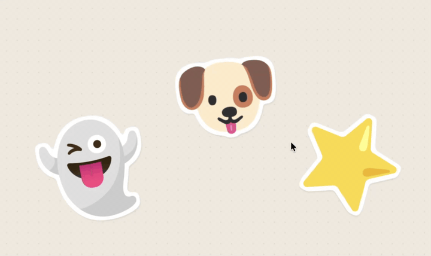

# sticker-peel-demo

Interactive sticker peel + drag effect built with React, Vite, and Framer Motion. Stickers can be picked up, dragged, rotated by sway, and re-placed — with a curled flap that casts its own shadow, an alpha-shape hit test, and a cursor-tracked shine band.

Live demo: https://sticker-peel-demo.vercel.app/



## Run

```bash
npm install
npm run dev
```

Then open the URL Vite prints. Tweak the effect live with the Leva panel in the top-right.

## What's in here

- `src/Sticker.tsx` — the main component. Peel geometry, flap shadow, shine tracking, drag + sway.
- `src/pointerHitTest.ts` — single shared document `pointermove` listener (rAF-coalesced) that alpha-samples each sticker's PNG to gate `pointer-events`. One listener for the whole stage, not one per sticker.
- `src/useAlphaMap.ts`, `src/usePeelOffset.ts` — image-analysis hooks used by the hit test and peel anchor.
- `src/App.tsx` — stage, Leva knobs, sticker layout.
- `src/data.ts` — sticker definitions (position, rotation, source PNG).

## Notes

- Built on React 19, Vite 8, framer-motion 12.
- Pure visual demo — no persistence, no backend.
- Knobs include shadow tuning, peel direction/amount, drag sway, motion easing.

## License

MIT — see [LICENSE](./LICENSE).
